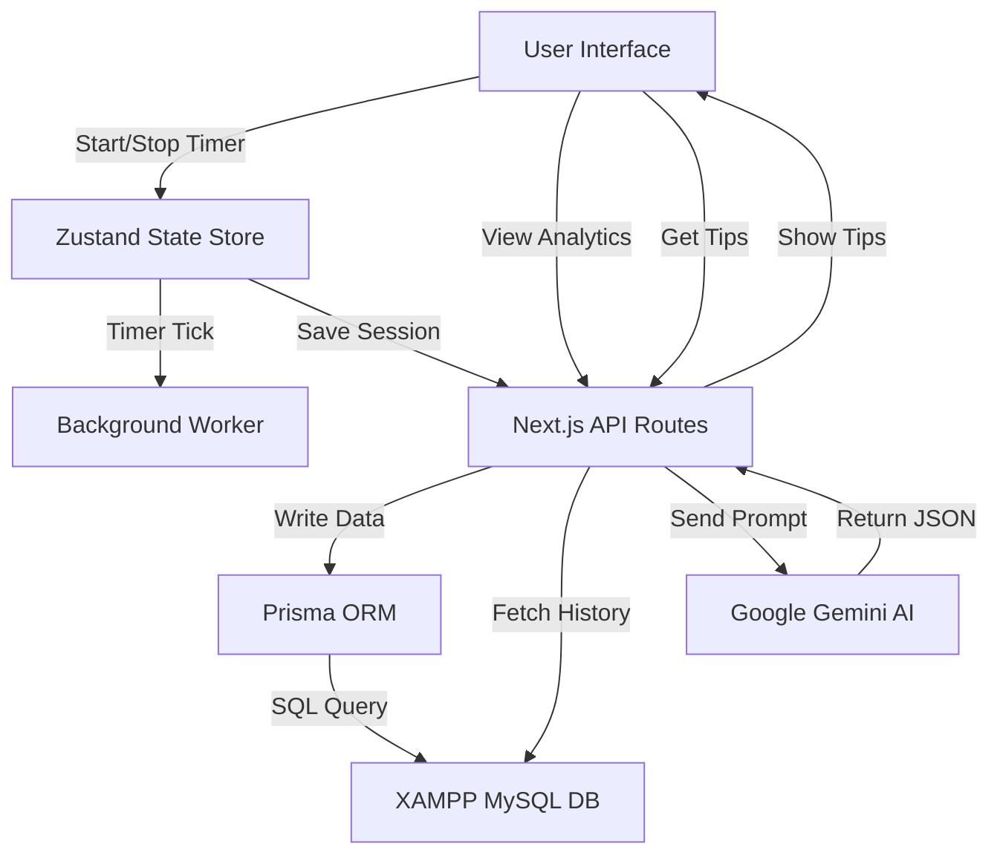

# Pomodoro AI Analytics - Project Documentation

## 1. Executive Summary
**Project Name:** Pomodoro AI Analytics
**Goal:** A web-based Pomodoro timer that tracks habits, visualizes productivity with charts, and uses AI to provide actionable advice.
**Core Philosophy:** "Zero-Cost, Local Powerhouse" — using powerful local tools and free-tier services.

---

## 2. Technology Stack

We have selected this industry-standard stack to ensure performance, scalability, and zero monthly costs.

### **Frontend (The Interface)**
*   **Framework:** **Next.js 14** (React)
    *   *Why:* The modern standard for Web Apps. Handles both the UI and the API logic in one place.
*   **Language:** **TypeScript** (JavaScript with types)
    *   *Why:* Prevents bugs by ensuring data structures (like Timer logs) are always correct.
*   **Styling:** **Tailwind CSS**
    *   *Why:* Rapid styling to match your hand-drawn mockups without writing separate CSS files.
*   **Charts:** **Recharts**
    *   *Why:* A React-specific library to build the "Weekly Trend" and "Productivity" graphs.

### **Backend & Database (The Brain & Memory)**
*   **Database:** **MySQL** (via **XAMPP**)
    *   *Why:* You already have it installed. It is robust, free, and runs locally on your PC.
*   **ORM:** **Prisma**
    *   *Why:* The "Bridge" between Next.js and MySQL. It allows us to write simple JavaScript code to save/load data, instead of complex SQL queries.
*   **AI Engine:** **Google Gemini API** (Model: `gemini-1.5-flash`)
    *   *Why:* Currently the best **Free Tier** AI available. It analyzes your session logs to generate tips like "You are most productive in the morning."

---

## 3. System Architecture

---

## 4. Development Plan (Roadmap)

Follow this checklist to build the application step-by-step.

### **Phase 1: Setup & Foundation (Estimated: 1-2 Hours)**
- [ ] **Initialize Project:** Create Next.js app with TypeScript & Tailwind.
- [ ] **Install Tools:** Install `prisma`, `@google/generative-ai`, `recharts`, `zustand`.
- [ ] **Database Setup:**
    - [ ] Start Apache & MySQL in XAMPP.
    - [ ] Create `pomodoro_db` in phpMyAdmin.
    - [ ] Configure `.env` with `DATABASE_URL`.
- [ ] **Schema Definition:** Write the `schema.prisma` file to define `Session` and `UserSettings` tables.

### **Phase 2: The Core Timer (Estimated: 3-4 Hours)**
- [ ] **State Management:** Create the `useTimerStore` (Zustand) to handle time, modes (Work/Break), and status.
- [ ] **Timer Engine:** Implement the Web Worker to ensure the timer doesn't stop when the tab is backgrounded.
- [ ] **UI Implementation:** Build the Dashboard with the Circular Timer and Control Buttons (Start/Pause/Stop).
- [ ] **Data Hook:** Connect the "Stop" button to the API to save the session to MySQL.

### **Phase 3: Analytics Dashboard (Estimated: 3 Hours)**
- [ ] **Data Fetching:** Create a Server Action to get `Daily` and `Weekly` session data from MySQL.
- [ ] **Visuals:**
    - [ ] Implement `BarChart` for "Sessions per Day".
    - [ ] Implement `PieChart` for "Work vs Break" distribution.
- [ ] **Summary Cards:** Display "Total Focus Time" and "Average Session Length".

### **Phase 4: AI "Smart" Features (Estimated: 2 Hours)**
- [ ] **Prompt Engineering:** Write the function that converts the last 50 MySQL records into a text summary for the AI.
- [ ] **API Integration:** Connect to Google Gemini to get the "Productivity Report".
- [ ] **UI Display:** Create the "AI Tips" card that shows the insights (e.g., "Best Focus Time: 8:00 AM").

---

## 5. Database Schema

This is exactly how your data will be structured in MySQL.

**Table: Session**
| Column | Type | Description |
| :--- | :--- | :--- |
| `id` | INT (PK) | Unique ID |
| `startTime` | DATETIME | When the session started |
| `duration` | INT | Length in seconds |
| `type` | VARCHAR | 'WORK', 'SHORT_BREAK', 'LONG_BREAK' |
| `completed` | BOOLEAN | True if timer finished naturally |
| `pauseCount` | INT | Number of interruptions |

**Table: UserSettings**
| Column | Type | Description |
| :--- | :--- | :--- |
| `id` | INT (PK) | Unique ID |
| `workDuration` | INT | Preferred work length (e.g., 25) |
| `aiLastAnalysis` | JSON | Cached result from Gemini |
